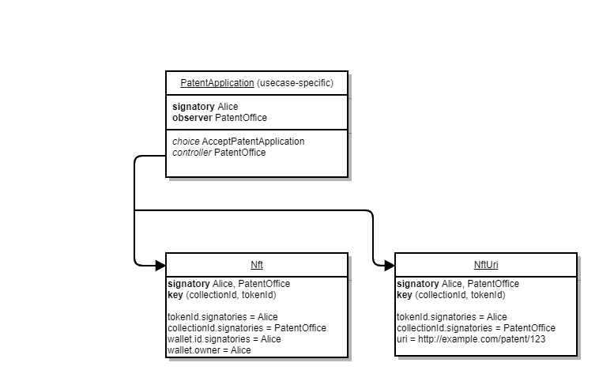

# daml-nft

    Copyright (c) 2022, ASX Operations Pty Ltd. All rights reserved.
    SPDX-License-Identifier: Apache-2.0

## Introduction

This project contains a library for non-fungible tokens (NFTs) in the the Digital Asset Modelling Language
([Daml](https://daml.com)). It is highly generic and applicable to any type of non-fungible asset. Rather than
developers writing custom Daml code from scratch for an NFT project, this library can be used as a basis to build an
application. By having a common standard library for NFTs, developers can develop interoperable smart contracts, opening
new opportunities for trading, lending, liquidity and other applications.

## Quick start

Due to Daml lacking a package management system, the recommended way to use this project is to copy the code as a git
submodule before building the code:

```bash
git submodule add https://github.com/SynfiniDLT/daml-nft
daml build --project-root daml-nft/core-model/main
```

Then, in your own `daml.yaml` file, add a dependency on the DAR file compiled in the previous step:

```yaml
dependencies:
- ./your/path/to/daml-nft/core-model/main/.daml/dist/nft-core-model-0.1.0.dar
```

Now you should be able to import the core templates:

```haskell
import Synfini.Nft
```

## Signatories and identifiers

The templates are structured using flexible signatories. This is designed to allow developers to choose signatories most
appropriate to a particular usecase. The signatories are attached to each identifier/key type. NFTs are grouped into
collections, which have the following identifier:

```haskell
-- ^ Unique identifier for a particular collection of Nfts. This is roughly analgous to an ERC-721 contract address.
data CollectionId = CollectionId
  with
    signatories : Set Party -- ^ Parties whos authority is required in order to mint Nfts within the collection.
    value : Text -- ^ Uniquely identifying label.
  deriving (Show, Eq, Ord)
```

Within each collection, each NFT is uniquely identified by its token ID:

```haskell
-- ^ Unique identifier of a particular Nft within a collection.
data TokenId = TokenId
  with
    signatories : Set Party -- ^ Parties whos authority is required in order to mint the Nft. The isser will usually be
    -- included in this set, but it is flexible depending on the usecase.
    value : Text -- ^ Uniquely identifying label.
  deriving (Show, Eq, Ord)
```

A party may have one or more wallets in which they hold NFTs. Each wallet has a unique wallet ID, an owner and provider:

```haskell
-- ^ Unique identifier of an Nft wallet.
data WalletId = WalletId
  with
    signatories : Set Party -- ^ Parties who authority is required to send an Nft to a particular wallet. Can include
    -- the wallet owner and/or a custodian, depending on the application. 
    value : Text -- ^ Uniquely identifying label.
  deriving (Show, Eq, Ord)

-- ^ An nft wallet.
data Wallet = Wallet
  with
    id : WalletId -- ^ Unique identifier of the wallet.
    provider : Party -- ^ Wallet provider, such as a custodian or registry operator. Can be the same as 'owner' for a
    -- self-custody model.
    owner : Party -- ^ Wallet owner.
  deriving (Show, Eq)
```

## Using the templates

An `Nft` contract assigns ownership of an NFT to a particular wallet. It is uniquely identified by its contract key -
the combination of its collection ID and token ID - making it impossible to create a duplicate NFT. The contract is
jointly signed by the collection ID, token ID and wallet ID signatories. Any metadata associated with the NFT, such as
a descriptive name or link to metadata hosted off-ledger, is stored in separate contracts. This allows for different
choices of whether to host metadata on or off-ledger, or to define customized metadata templates. Basic metadata
templates are available in the `Synfini.Nft.Metadata` module.

The process of gathering the signatures of the `Nft` contract is usecase-specific. For example, to implement a patent
register, each `Nft` contract must be signed by the Patent Office, who is responsible for approving any patent
application. An application would be sent to the Patent Office by the creation of a contract signed by the inventor 
(Alice in the example below). The contract would provide the Patent Office a choice to grant the patent, which if
exercised, creates an `Nft` contract along with any additional metadata contracts required.



In this example, the `NftUri` template from this library is used to store the URI of a JSON document containing the
patent metadata.

## Transferring NFTs

The authorization of the wallet ID signatories is required in order to create an `Nft` contract. These signatories will
likely change when ownership is transferred to a different wallet. Therefore we need to be granted authority from the
signatories of the receiving wallet when a transfer needs to be made. To solve this problem, an `NftAcquisitionRule`
contract can be created. This allows for a particular wallet to acquire NFTs from other parties, by allowing them to
exercise the `Acquire` choice, resulting in the creation of the NFT in the wallet.

The `Nft` template is deliberately designed so that it does not provide the owner a choice to transfer the NFT. Rather,
a separate template, `NftTransferRule`, must be instantiated in order to enable transfers. This is to cater for
usecases where additional checks are required before transfer, such as payment of royalties or taxes, KYC checks or
regulatory approval. In such examples the `NftTransferRule` can still be used, but must be created and archived within
a transaction.

Continuing from the previous example, if Alice now wishes to transfer the ownership of the patent to Bob, then the
following workflow would take place:


The `Transfer` choice  archives the existing `Nft` before exercising the `Acquire` choice on Bob's
`NftAcquisitionRule`, resulting in the creation of the `Nft` in Bob's wallet.
